Molecular clock dating
================
Louis du Plessis
Last modified: 01 Nov 2023

- [Divergence dates](#divergence-dates)
  - [ZH1540 included](#zh1540-included)
  - [ZH1540 excluded](#zh1540-excluded)
  - [Combined](#combined)
- [MCC trees](#mcc-trees)
  - [ZH1540 included](#zh1540-included-1)
  - [ZH1540 excluded](#zh1540-excluded-1)
- [Session info](#session-info)

    ## Error in file(file, "rt"): cannot open the connection

# Divergence dates

## ZH1540 included

|               |  Median |           (95% HPD) | Pr(monophyletic) |
|:--------------|--------:|--------------------:|-----------------:|
| TPA (SS14-ω)  |  1737.5 | (1490.91 - 1888.38) |             0.98 |
| TPA (SS14)    | 1127.06 |  (641.83 - 1436.09) |             0.97 |
| TPA (Nichols) | 1237.65 |  (729.93 - 1689.21) |             0.98 |
| TPA           |  844.36 |  (-41.67 - 1375.99) |             0.97 |
| TPE           |  835.12 |   (27.62 - 1299.16) |             0.98 |
| TEN           |    47.2 |  (-779.82 - 449.48) |             0.99 |

Posterior TMRCA estimates for clades (with ZH1540 included). The
posterior probability that a clade is monophyletic is calculated as the
proportion of posterior trees where the clade is monophyletic.

<figure>
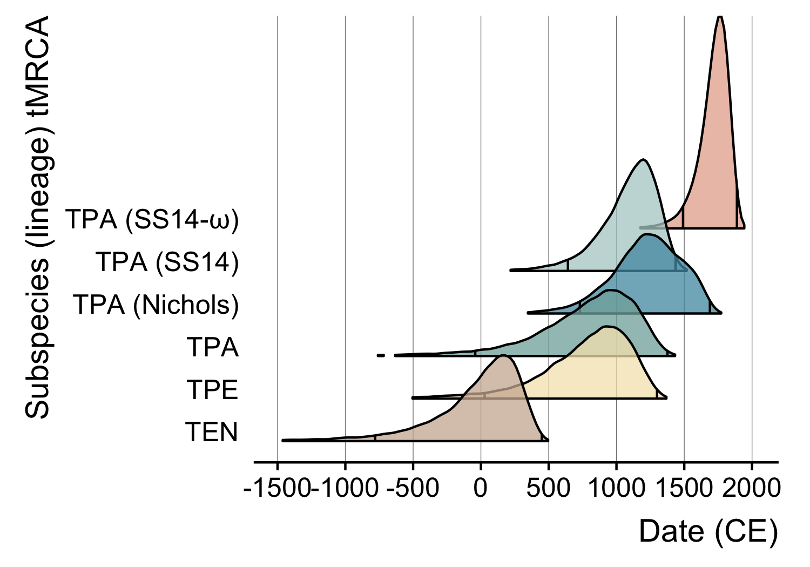
<figcaption aria-hidden="true">Divergence dates (all)</figcaption>
</figure>

## ZH1540 excluded

    ## Error in eval(expr, envir, enclos): object 'trace.noZH1540.uced.narrow' not found

    ## Error in eval(expr, envir, enclos): object 'trace.noZH1540.uced.narrow' not found

    ## Error in eval(expr, envir, enclos): object 'cladeTMRCAs.noZH1540.uced.narrow' not found

    ## Error in eval(expr, envir, enclos): object 'cladeTMRCAs.noZH1540.uced.narrow' not found

    ## Error in eval(expr, envir, enclos): object 'monophyletic.noZH1540.uced.narrow' not found

    ## Error in eval(expr, envir, enclos): object 'cladeTMRCAHPD.noZH1540.uced.narrow' not found

|      |  Median |           (95% HPD) | Pr(monophyletic) |
|:-----|--------:|--------------------:|-----------------:|
| NULL |  1737.5 | (1490.91 - 1888.38) |             0.98 |
| NULL | 1127.06 |  (641.83 - 1436.09) |             0.97 |
| NULL | 1237.65 |  (729.93 - 1689.21) |             0.98 |
| NULL |  844.36 |  (-41.67 - 1375.99) |             0.97 |
| NULL |  835.12 |   (27.62 - 1299.16) |             0.98 |
| NULL |    47.2 |  (-779.82 - 449.48) |             0.99 |

Posterior TMRCA estimates for clades (with ZH1540 included). The
posterior probability that a clade is monophyletic is calculated as the
proportion of posterior trees where the clade is monophyletic.

    ## Error in eval(expr, envir, enclos): object 'cladeTMRCAs.noZH1540.uced.narrow' not found

<figure>

<figcaption aria-hidden="true">Divergence dates (noZH1540)</figcaption>
</figure>

## Combined

<figure>
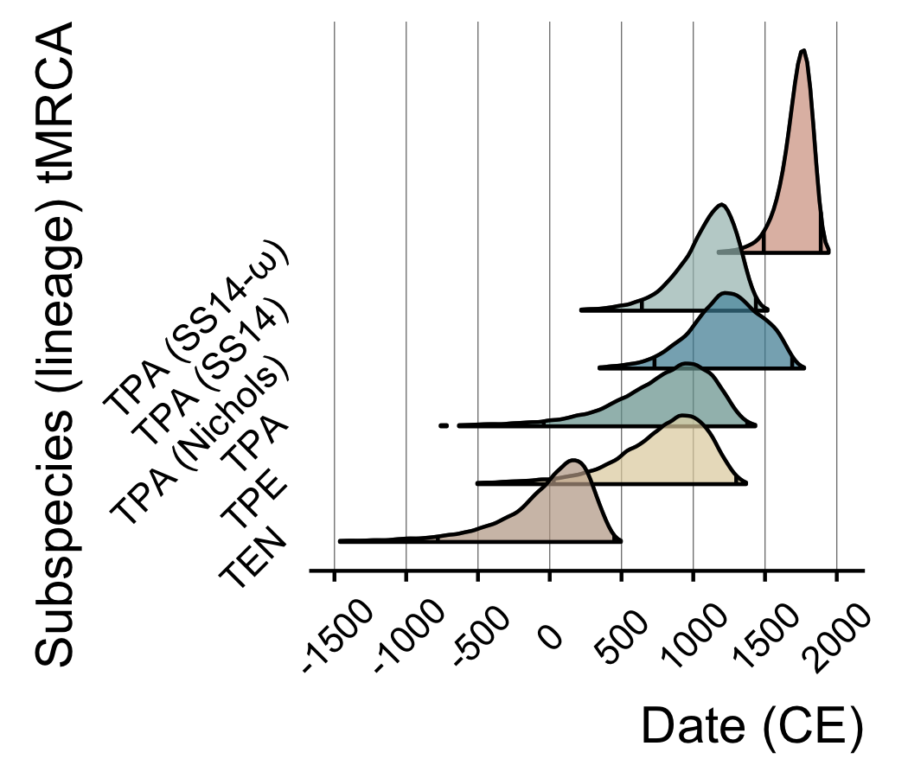
<figcaption aria-hidden="true">Divergence dates (combined)</figcaption>
</figure>

# MCC trees

## ZH1540 included

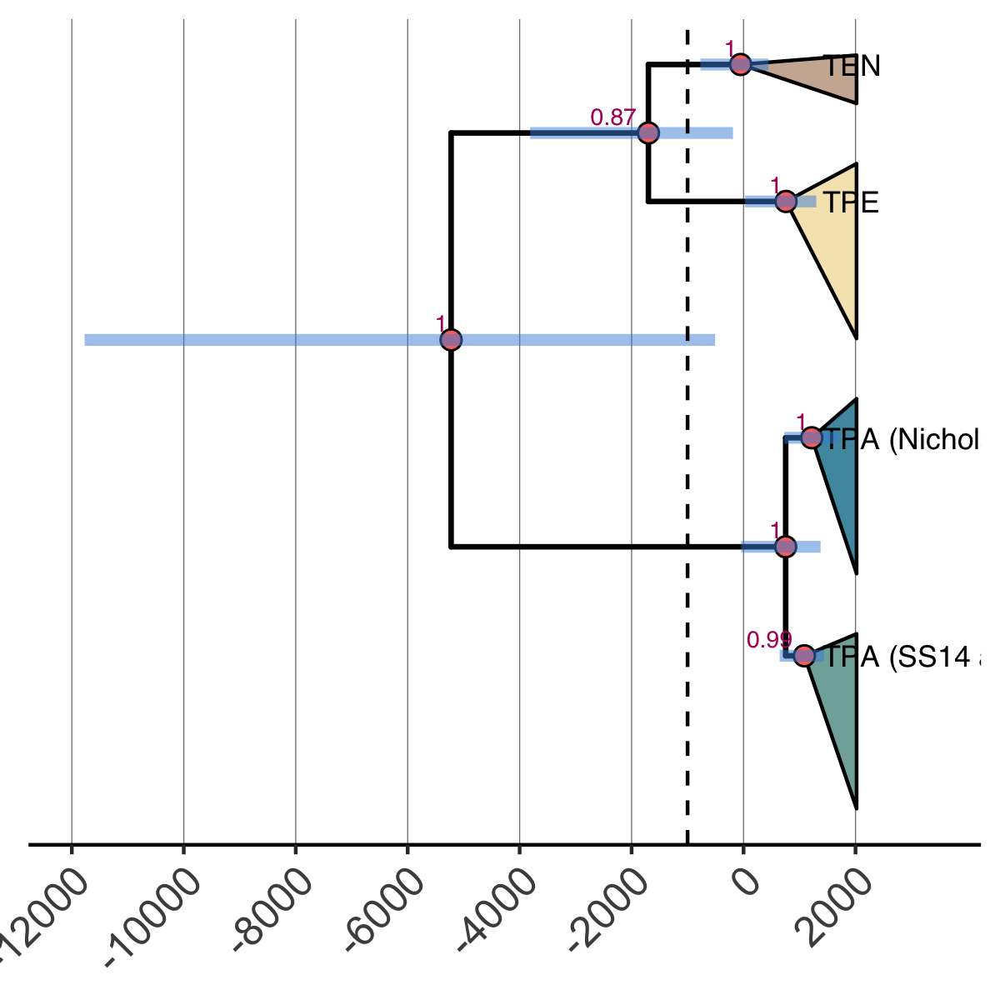<!-- -->

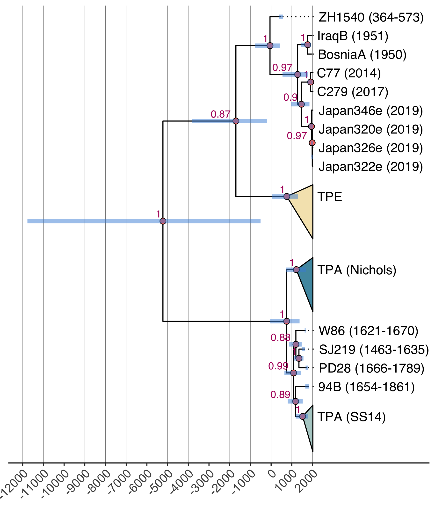<!-- -->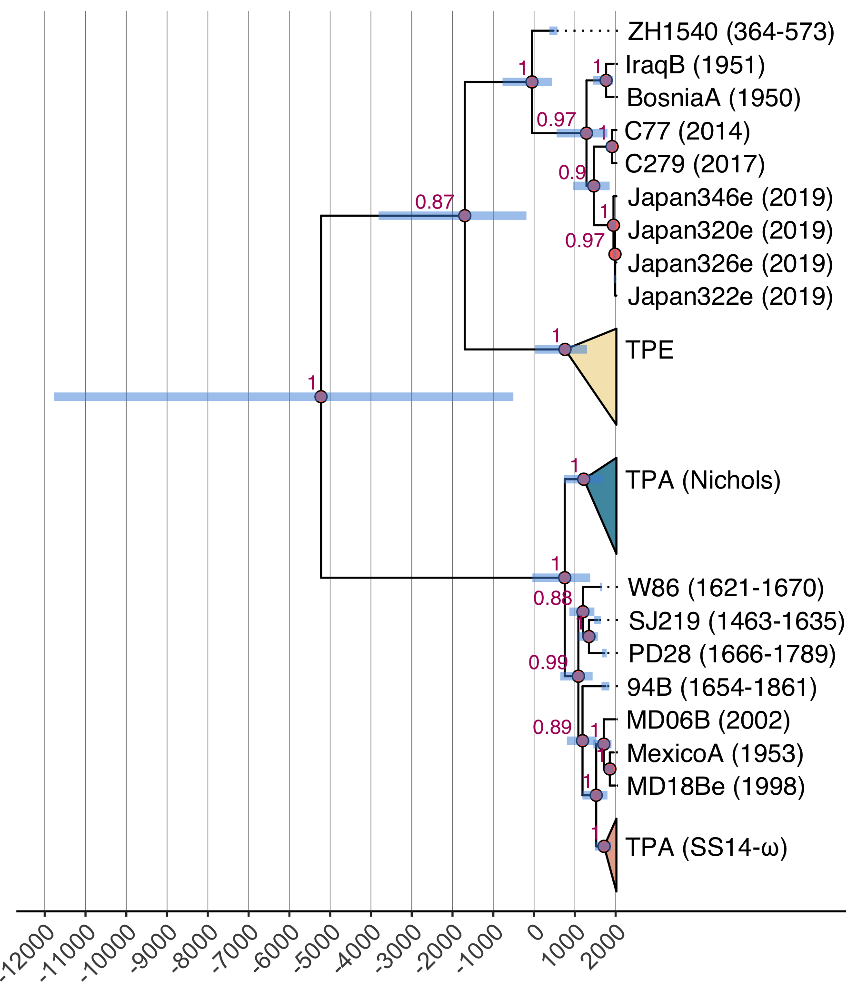<!-- -->

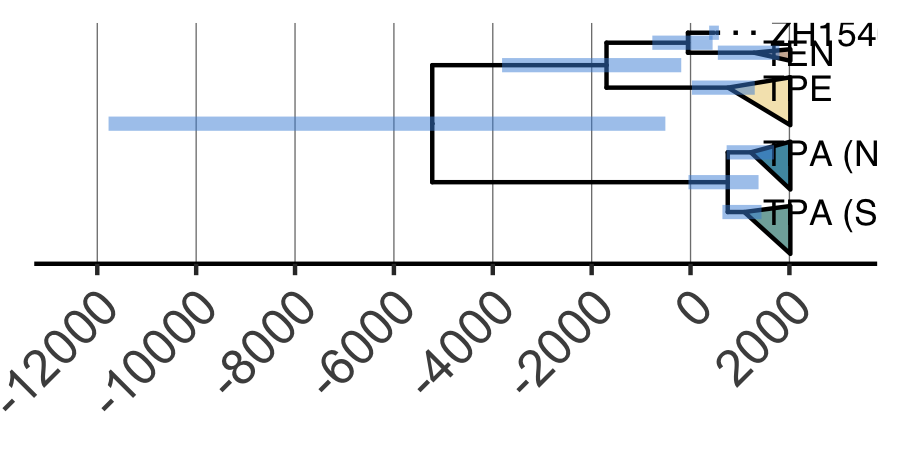<!-- -->

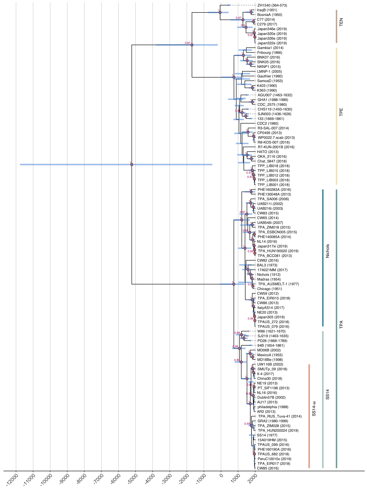<!-- -->

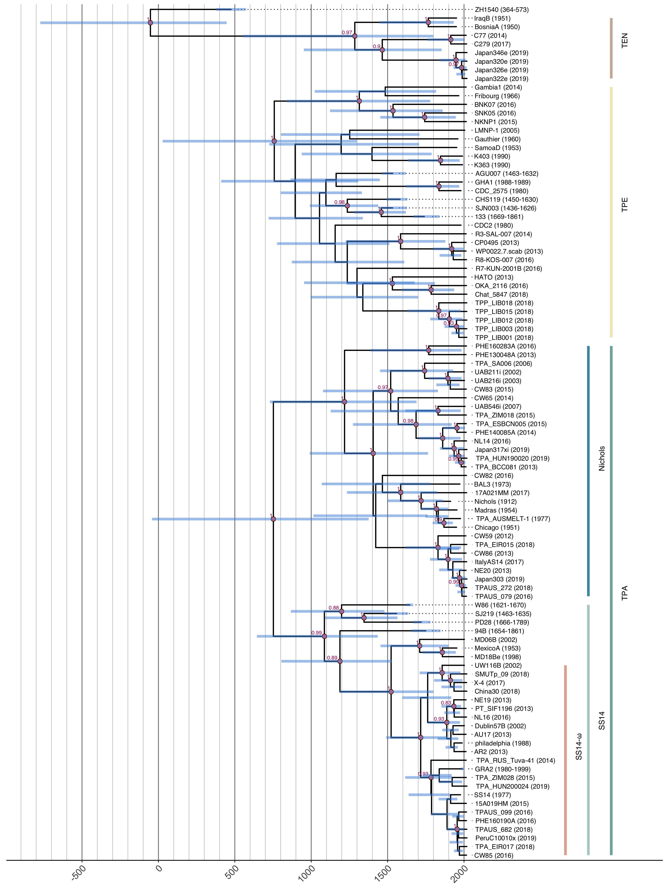<!-- -->

## ZH1540 excluded

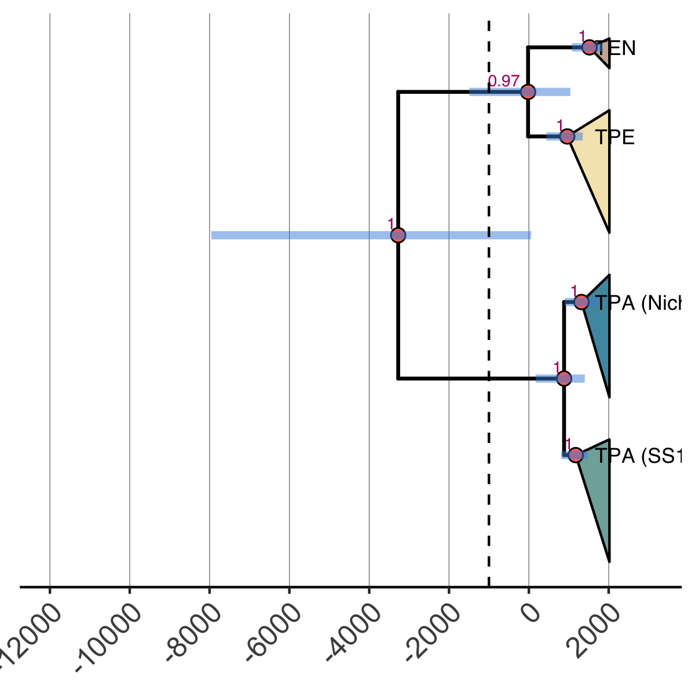<!-- -->

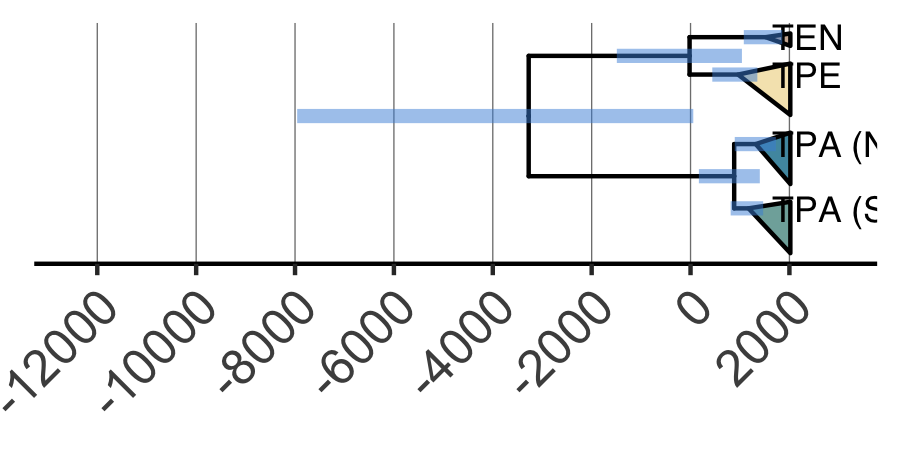<!-- -->

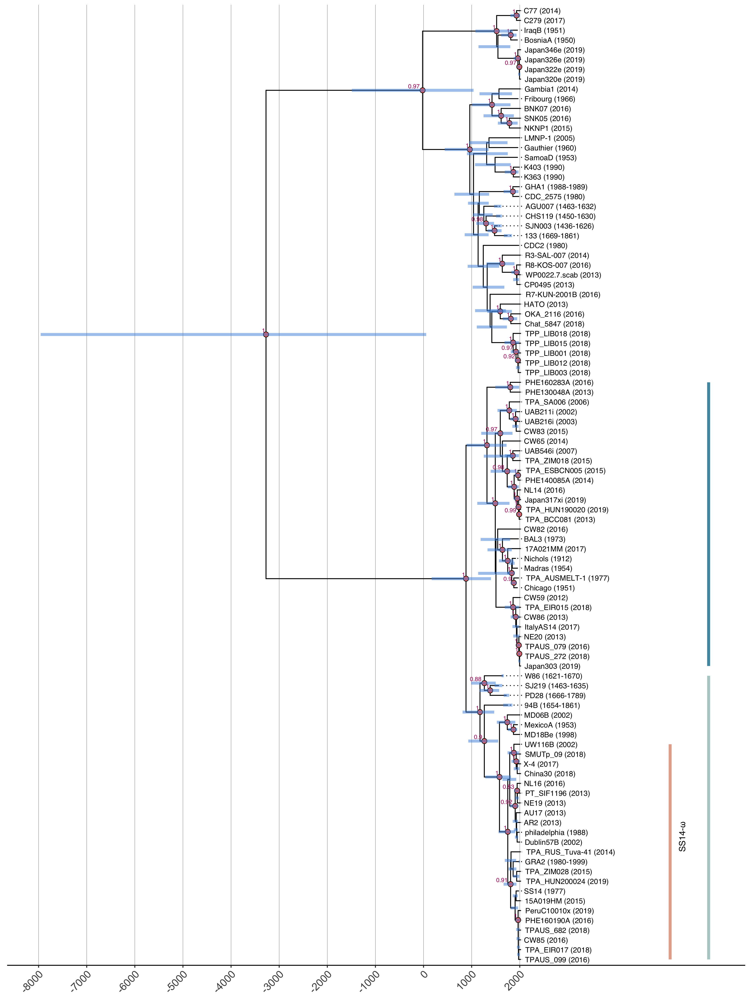<!-- -->

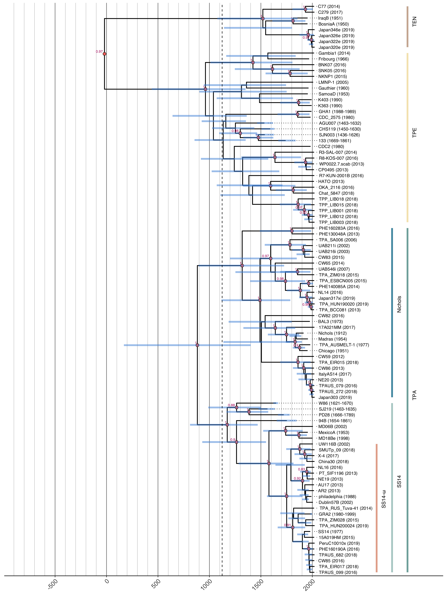<!-- -->

# Session info

    ## R version 4.3.0 (2023-04-21)
    ## Platform: x86_64-apple-darwin20 (64-bit)
    ## Running under: macOS Ventura 13.6
    ## 
    ## Matrix products: default
    ## BLAS:   /Library/Frameworks/R.framework/Versions/4.3-x86_64/Resources/lib/libRblas.0.dylib 
    ## LAPACK: /Library/Frameworks/R.framework/Versions/4.3-x86_64/Resources/lib/libRlapack.dylib;  LAPACK version 3.11.0
    ## 
    ## locale:
    ## [1] en_US.UTF-8/en_US.UTF-8/en_US.UTF-8/C/en_US.UTF-8/en_US.UTF-8
    ## 
    ## time zone: Europe/Zurich
    ## tzcode source: internal
    ## 
    ## attached base packages:
    ## [1] stats     graphics  grDevices utils     datasets  methods   base     
    ## 
    ## other attached packages:
    ##  [1] ggsci_3.0.0     ggtree_3.8.0    treeio_1.24.1   ggridges_0.5.4 
    ##  [5] lubridate_1.9.2 forcats_1.0.0   stringr_1.5.0   dplyr_1.1.2    
    ##  [9] purrr_1.0.1     readr_2.1.4     tidyr_1.3.0     tibble_3.2.1   
    ## [13] ggplot2_3.4.2   tidyverse_2.0.0 beastio_0.3.3   coda_0.19-4    
    ## 
    ## loaded via a namespace (and not attached):
    ##  [1] yulab.utils_0.0.6  utf8_1.2.3         generics_0.1.3     ggplotify_0.1.1   
    ##  [5] stringi_1.7.12     lattice_0.21-8     hms_1.1.3          digest_0.6.32     
    ##  [9] magrittr_2.0.3     evaluate_0.21      grid_4.3.0         timechange_0.2.0  
    ## [13] fastmap_1.1.1      jsonlite_1.8.7     ape_5.7-1          aplot_0.1.10      
    ## [17] fansi_1.0.4        scales_1.2.1       codetools_0.2-19   lazyeval_0.2.2    
    ## [21] cli_3.6.1          rlang_1.1.1        munsell_0.5.0      tidytree_0.4.2    
    ## [25] withr_2.5.0        yaml_2.3.7         tools_4.3.0        parallel_4.3.0    
    ## [29] tzdb_0.4.0         colorspace_2.1-0   gridGraphics_0.5-1 vctrs_0.6.3       
    ## [33] R6_2.5.1           lifecycle_1.0.3    ggfun_0.1.1        pkgconfig_2.0.3   
    ## [37] pillar_1.9.0       gtable_0.3.3       glue_1.6.2         Rcpp_1.0.10       
    ## [41] highr_0.10         xfun_0.39          tidyselect_1.2.0   rstudioapi_0.14   
    ## [45] knitr_1.43         farver_2.1.1       patchwork_1.1.2    htmltools_0.5.5   
    ## [49] nlme_3.1-162       labeling_0.4.2     rmarkdown_2.23     compiler_4.3.0
