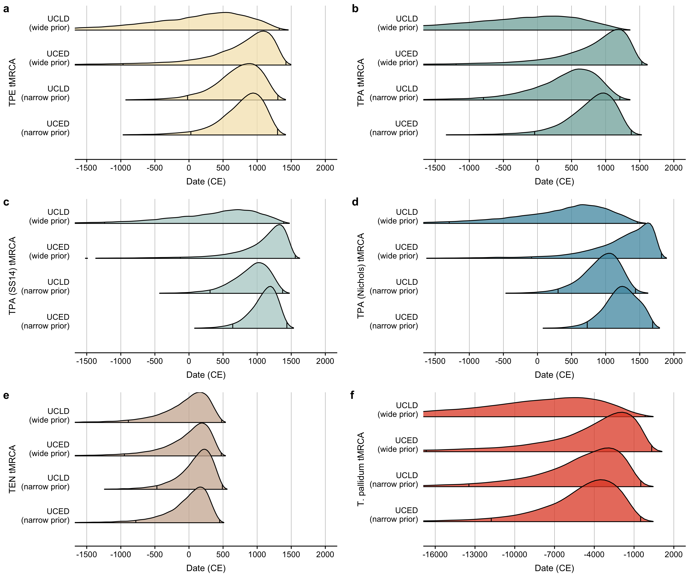
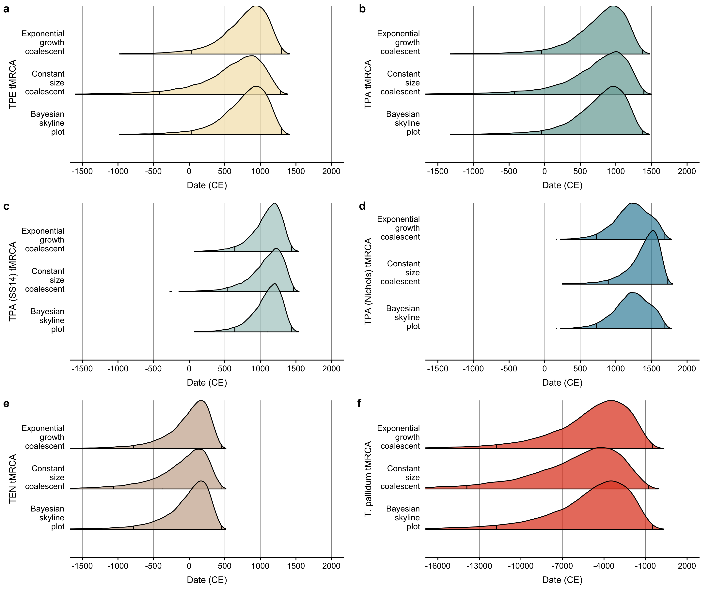

Molecular clock dating (robustness analysis)
================
Louis du Plessis
Last modified: 01 Nov 2023

- [Clock model comparison](#clock-model-comparison)
- [Tree model comparison](#tree-model-comparison)
- [Session info](#session-info)

# Clock model comparison

<figure>

<figcaption aria-hidden="true">Divergence dates (all)</figcaption>
</figure>

# Tree model comparison

<figure>

<figcaption aria-hidden="true">Divergence dates (all)</figcaption>
</figure>

# Session info

    ## R version 4.3.0 (2023-04-21)
    ## Platform: x86_64-apple-darwin20 (64-bit)
    ## Running under: macOS Ventura 13.6
    ## 
    ## Matrix products: default
    ## BLAS:   /Library/Frameworks/R.framework/Versions/4.3-x86_64/Resources/lib/libRblas.0.dylib 
    ## LAPACK: /Library/Frameworks/R.framework/Versions/4.3-x86_64/Resources/lib/libRlapack.dylib;  LAPACK version 3.11.0
    ## 
    ## locale:
    ## [1] en_US.UTF-8/en_US.UTF-8/en_US.UTF-8/C/en_US.UTF-8/en_US.UTF-8
    ## 
    ## time zone: Europe/Zurich
    ## tzcode source: internal
    ## 
    ## attached base packages:
    ## [1] stats     graphics  grDevices utils     datasets  methods   base     
    ## 
    ## other attached packages:
    ##  [1] cowplot_1.1.1   ggridges_0.5.4  lubridate_1.9.2 forcats_1.0.0  
    ##  [5] stringr_1.5.0   dplyr_1.1.2     purrr_1.0.1     readr_2.1.4    
    ##  [9] tidyr_1.3.0     tibble_3.2.1    ggplot2_3.4.2   tidyverse_2.0.0
    ## [13] beastio_0.3.3   coda_0.19-4    
    ## 
    ## loaded via a namespace (and not attached):
    ##  [1] gtable_0.3.3     highr_0.10       compiler_4.3.0   tidyselect_1.2.0
    ##  [5] scales_1.2.1     yaml_2.3.7       fastmap_1.1.1    lattice_0.21-8  
    ##  [9] R6_2.5.1         labeling_0.4.2   generics_0.1.3   knitr_1.43      
    ## [13] munsell_0.5.0    pillar_1.9.0     tzdb_0.4.0       rlang_1.1.1     
    ## [17] utf8_1.2.3       stringi_1.7.12   xfun_0.39        timechange_0.2.0
    ## [21] cli_3.6.1        withr_2.5.0      magrittr_2.0.3   digest_0.6.32   
    ## [25] grid_4.3.0       rstudioapi_0.14  hms_1.1.3        lifecycle_1.0.3 
    ## [29] vctrs_0.6.3      evaluate_0.21    glue_1.6.2       farver_2.1.1    
    ## [33] codetools_0.2-19 fansi_1.0.4      colorspace_2.1-0 rmarkdown_2.23  
    ## [37] tools_4.3.0      pkgconfig_2.0.3  htmltools_0.5.5
