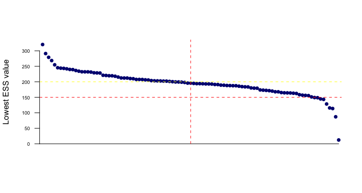
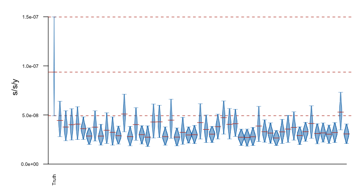

BEAST2 UCED date shuffling analyses
================
Louis du Plessis
Last modified: 01 Nov 2023

- [Methods](#methods)
  - [Dataset](#dataset)
  - [Model](#model)
  - [Analyses](#analyses)
- [Results](#results)
  - [Convergence](#convergence)
  - [Rate comparison](#rate-comparison)
- [Session info](#session-info)

# Methods

## Dataset

Sampling dates of ancient samples were fixed to the mean of the
radiocarbon date range.

## Model

Used UCED model with dates fixed to the mean radiocarbon age.

## Analyses

All analyses were performed in BEAST v2.6.7. MCMC chains were run for
500 million steps and parameters sampled every 10,000 steps. 10% of
samples were discarded as burn-in.

# Results

## Convergence

<!-- -->

## Rate comparison

<figure>

<figcaption aria-hidden="true">Date shuffling analyses performed under a
<strong>relaxed clock</strong> models. The plot shows the posterior
distributions for the mean clock rate, truncated at the upper and lower
limits of the 95% HPD interval. Horizontal red lines indicate the
medians of the posterior distributions. The red dashed lines indicate
the median and upper and lower limits of the 95% HPD interval of the
clock rate inferred under the true sampling dates.</figcaption>
</figure>

# Session info

    ## R version 4.3.0 (2023-04-21)
    ## Platform: x86_64-apple-darwin20 (64-bit)
    ## Running under: macOS Ventura 13.6
    ## 
    ## Matrix products: default
    ## BLAS:   /Library/Frameworks/R.framework/Versions/4.3-x86_64/Resources/lib/libRblas.0.dylib 
    ## LAPACK: /Library/Frameworks/R.framework/Versions/4.3-x86_64/Resources/lib/libRlapack.dylib;  LAPACK version 3.11.0
    ## 
    ## locale:
    ## [1] en_US.UTF-8/en_US.UTF-8/en_US.UTF-8/C/en_US.UTF-8/en_US.UTF-8
    ## 
    ## time zone: Europe/Zurich
    ## tzcode source: internal
    ## 
    ## attached base packages:
    ## [1] stats     graphics  grDevices utils     datasets  methods   base     
    ## 
    ## other attached packages:
    ## [1] beastio_0.3.3 coda_0.19-4   cowplot_1.1.1
    ## 
    ## loaded via a namespace (and not attached):
    ##  [1] vctrs_0.6.3      cli_3.6.1        knitr_1.43       rlang_1.1.1     
    ##  [5] xfun_0.39        highr_0.10       generics_0.1.3   glue_1.6.2      
    ##  [9] colorspace_2.1-0 htmltools_0.5.5  scales_1.2.1     fansi_1.0.4     
    ## [13] rmarkdown_2.23   grid_4.3.0       evaluate_0.21    munsell_0.5.0   
    ## [17] tibble_3.2.1     fastmap_1.1.1    yaml_2.3.7       lifecycle_1.0.3 
    ## [21] compiler_4.3.0   codetools_0.2-19 dplyr_1.1.2      pkgconfig_2.0.3 
    ## [25] rstudioapi_0.14  lattice_0.21-8   digest_0.6.32    R6_2.5.1        
    ## [29] tidyselect_1.2.0 utf8_1.2.3       pillar_1.9.0     magrittr_2.0.3  
    ## [33] ggsci_3.0.0      tools_4.3.0      gtable_0.3.3     ggplot2_3.4.2
