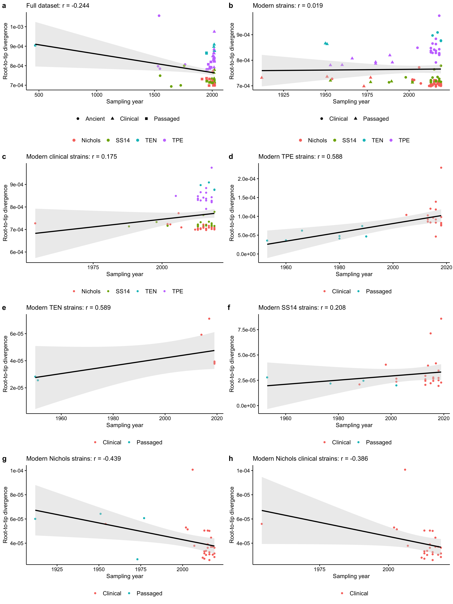
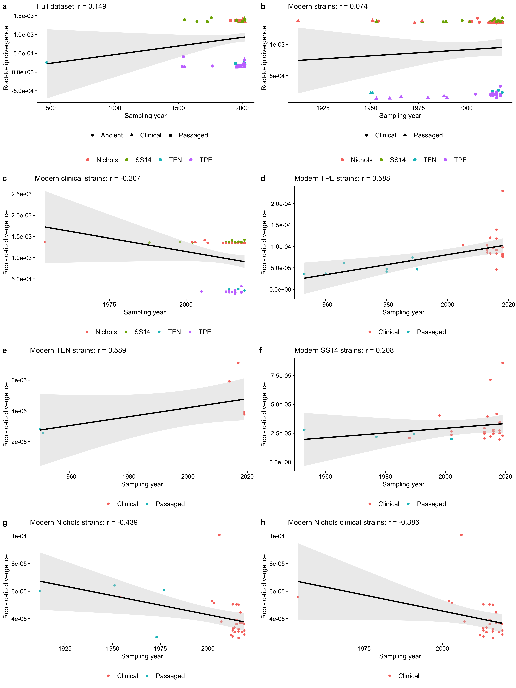
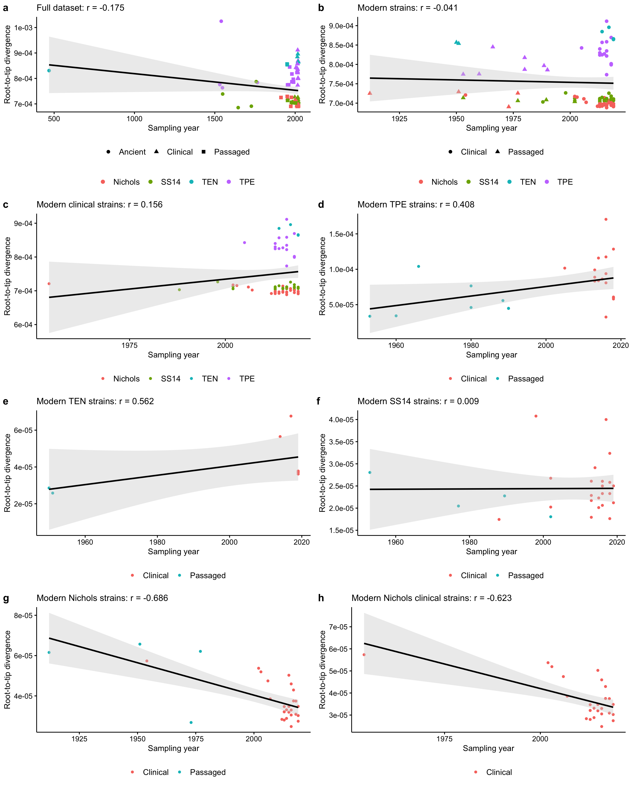

Temporal signal from root-to-tip regression
================
Louis du Plessis
Last modified: 01 Nov 2023

- [Alignment without recombining and hypervariable
  genes](#alignment-without-recombining-and-hypervariable-genes)
  - [Root in middle of root branch](#root-in-middle-of-root-branch)
  - [Root at optimal point for root-to-tip
    correlation](#root-at-optimal-point-for-root-to-tip-correlation)
- [Alignment without recombining, hypervariable, 16S and 23S
  genes](#alignment-without-recombining-hypervariable-16s-and-23s-genes)
- [Session info](#session-info)

# Alignment without recombining and hypervariable genes

## Root in middle of root branch

<!-- -->

## Root at optimal point for root-to-tip correlation

<!-- -->

# Alignment without recombining, hypervariable, 16S and 23S genes

<!-- -->

# Session info

    ## R version 4.3.0 (2023-04-21)
    ## Platform: x86_64-apple-darwin20 (64-bit)
    ## Running under: macOS Ventura 13.6
    ## 
    ## Matrix products: default
    ## BLAS:   /Library/Frameworks/R.framework/Versions/4.3-x86_64/Resources/lib/libRblas.0.dylib 
    ## LAPACK: /Library/Frameworks/R.framework/Versions/4.3-x86_64/Resources/lib/libRlapack.dylib;  LAPACK version 3.11.0
    ## 
    ## locale:
    ## [1] en_US.UTF-8/en_US.UTF-8/en_US.UTF-8/C/en_US.UTF-8/en_US.UTF-8
    ## 
    ## time zone: Europe/Zurich
    ## tzcode source: internal
    ## 
    ## attached base packages:
    ## [1] stats     graphics  grDevices utils     datasets  methods   base     
    ## 
    ## other attached packages:
    ##  [1] phangorn_2.11.1     phytools_1.9-16     maps_3.4.1         
    ##  [4] ggpubr_0.6.0        ggsci_3.0.0         ggtreeExtra_1.10.0 
    ##  [7] ggtree_3.8.0        treeio_1.24.1       tidytree_0.4.2     
    ## [10] ggplot2_3.4.2       dplyr_1.1.2         ape_5.7-1          
    ## [13] treedataverse_0.0.1 cowplot_1.1.1      
    ## 
    ## loaded via a namespace (and not attached):
    ##  [1] fastmatch_1.1-3         gtable_0.3.3            xfun_0.39              
    ##  [4] rstatix_0.7.2           lattice_0.21-8          numDeriv_2016.8-1.1    
    ##  [7] quadprog_1.5-8          vctrs_0.6.3             tools_4.3.0            
    ## [10] generics_0.1.3          yulab.utils_0.0.6       parallel_4.3.0         
    ## [13] tibble_3.2.1            fansi_1.0.4             highr_0.10             
    ## [16] pkgconfig_2.0.3         Matrix_1.5-4.1          ggnewscale_0.4.9       
    ## [19] ggplotify_0.1.1         scatterplot3d_0.3-44    lifecycle_1.0.3        
    ## [22] farver_2.1.1            compiler_4.3.0          mnormt_2.1.1           
    ## [25] munsell_0.5.0           combinat_0.0-8          codetools_0.2-19       
    ## [28] carData_3.0-5           ggfun_0.1.1             htmltools_0.5.5        
    ## [31] yaml_2.3.7              lazyeval_0.2.2          pillar_1.9.0           
    ## [34] car_3.1-2               crayon_1.5.2            tidyr_1.3.0            
    ## [37] MASS_7.3-60             clusterGeneration_1.3.7 iterators_1.0.14       
    ## [40] abind_1.4-5             foreach_1.5.2           nlme_3.1-162           
    ## [43] tidyselect_1.2.0        aplot_0.1.10            digest_0.6.32          
    ## [46] purrr_1.0.1             labeling_0.4.2          splines_4.3.0          
    ## [49] fastmap_1.1.1           grid_4.3.0              expm_0.999-7           
    ## [52] colorspace_2.1-0        cli_3.6.1               magrittr_2.0.3         
    ## [55] patchwork_1.1.2         optimParallel_1.0-2     utf8_1.2.3             
    ## [58] broom_1.0.5             withr_2.5.0             scales_1.2.1           
    ## [61] backports_1.4.1         plotrix_3.8-2           rmarkdown_2.23         
    ## [64] igraph_1.5.0.1          ggsignif_0.6.4          coda_0.19-4            
    ## [67] evaluate_0.21           knitr_1.43              doParallel_1.0.17      
    ## [70] mgcv_1.8-42             gridGraphics_0.5-1      rlang_1.1.1            
    ## [73] Rcpp_1.0.10             glue_1.6.2              rstudioapi_0.14        
    ## [76] jsonlite_1.8.7          R6_2.5.1
